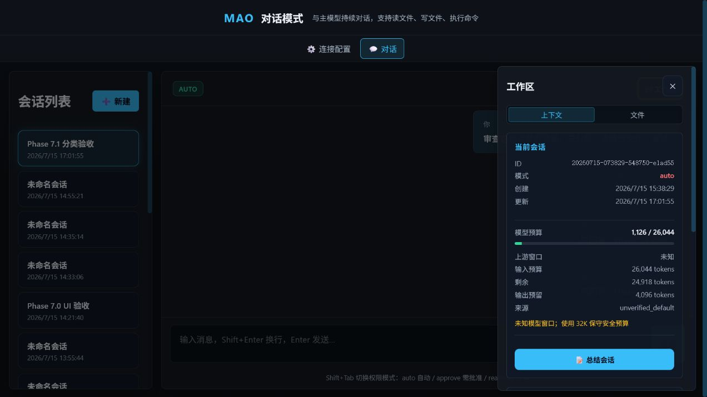
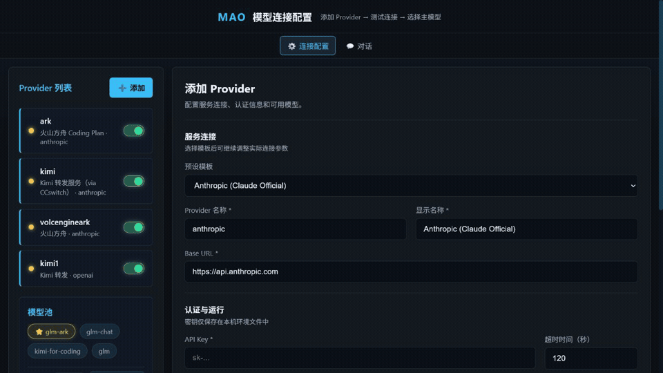

# MAO - Evidence-Driven Multi-Model Engineering Agent

[](https://github.com/Wanbinyu/multi-agent-orchestrator/actions/workflows/ci.yml)


MAO 面向需要接入多个模型服务的开发者：它在 CLI 和 WebUI 中执行工程任务，并用明确的读写边界、工具证据、验证门和有界 Worker 协作约束模型行为。核心目标不是单纯增加并发，而是在选择不同模型能力与成本的同时，让使用者知道系统做了什么、为什么能结束、还有哪些风险。

当前公开版本为 [`v0.1.0-beta.3`](https://github.com/Wanbinyu/multi-agent-orchestrator/releases/tag/v0.1.0-beta.3)。它适合在可信本机和可审查项目中试用，不是 Claude Code、Codex 或容器沙箱的完整替代品。

## 为什么做 MAO

我做这个工具的出发点，是希望节省 token，并尽可能发挥不同模型各自擅长的能力。

即使 Claude 和 GPT 的额度、套餐和上下文策略不断调整，仍然有很多人因为成本、地区、服务可用性或工作习惯而使用其他模型。我自己也曾因为 token 消耗得太快而苦恼，所以开始尝试把任务交给更合适的模型，并让整个过程有明确边界、证据和验证。这是我第一次完整地尝试开发 Agent，项目里一定还有不成熟的地方，欢迎提出问题、建议，或者把它当作一个可以继续发展的思路。

未来 token 也许会像水和电一样普遍，但即使成本不再是主要问题，不同模型依然会有各自的长处。因此，我认为一个能够组合模型能力、控制消耗并保留工程证据的工具仍然有必要存在。



### 60 秒真实工作流演示



演示依次展示 Provider 配置、`approve` 权限确认、受限项目结构与文件读取、结构化结论，以及工作区中的上下文预算、证据和本轮工程记录。演示任务为只读检查，未修改目标项目。

## 一键安装与启动

要求 Python 3.11 或 3.12。已安装 `pipx` 时，可以直接从 GitHub 安装到独立环境：

```bash
pipx install git+https://github.com/Wanbinyu/multi-agent-orchestrator.git
```

安装后，在要检查或修改的项目目录中运行：

```bash
mao
```

`mao` 默认进入终端对话；首次运行且当前目录没有 Provider 配置时，会先启动连接向导。配置、会话和输出均保存在当前项目目录，不会写进 Python 安装目录。

启动 WebUI：

```bash
mao web
```

浏览器默认打开 `http://127.0.0.1:8123`。首次可以先添加 Provider、测试连接并选择主模型；密钥只写入当前目录的 `.env`。旧命令 `mao-ui` 继续兼容。

升级或卸载：

```bash
pipx upgrade multi-agent-orchestrator
pipx uninstall multi-agent-orchestrator
```

如果最初使用 Git URL 安装，`pipx upgrade` 会继续使用已记录的 Git 来源。升级后可用 `mao --version` 检查当前版本。

没有 `pipx` 时，可先安装：

```bash
python -m pip install --user pipx
python -m pipx ensurepath
```

### 从源码开发

```bash
git clone --depth 1 https://github.com/Wanbinyu/multi-agent-orchestrator.git
cd multi-agent-orchestrator
python -m venv .venv
# Windows: .venv\Scripts\activate
# Linux/macOS: source .venv/bin/activate
python -m pip install -e ".[test]"
python -m pytest -q
```

## 已知限制与安全边界

- MAO 尚无容器级沙箱；命令以当前进程权限在本机执行。默认推荐 `approve`，不信任的项目使用 `readonly`。
- Provider 的鉴权、流式和原生工具兼容性不同；动态模型别名可能不暴露准确模型版本或硬上下文窗口。
- 未验证模型使用 32K 保守安全预算。该数字是 MAO 的本地保护值，不代表上游物理上限。
- 自动 CI 不调用真实付费模型；真实 Provider、多模型协作和摘要质量仍需人工烟雾验收。
- MCP Server 与 Hooks 是以 MAO 进程权限运行的第三方扩展，启用前必须审查配置和来源。

完整安全边界见 [`SECURITY.md`](SECURITY.md)，当前方向和发布状态见 [`docs/MAO-产品方向与Beta路线图.md`](docs/MAO-产品方向与Beta路线图.md)。

## 目录结构

```
multi-agent-orchestrator/
├── config/                   # 当前项目的 Provider、Worker 与扩展配置
├── docs/                     # 用户、扩展、路线图和发布文档
├── src/
│   ├── cli/                  # 终端交互与首次配置
│   ├── core/                 # Agent、Worker、调度、证据与上下文
│   ├── gateway/              # Provider 路由、故障切换与计费
│   ├── resources/            # 安装包内置的运行模板
│   ├── tools/                # 文件、命令、搜索、Web、MCP 与 Hooks
│   └── ui/                   # FastAPI WebUI
├── tests/                    # 开发与 CI 测试；不进入 wheel/发布归档
├── run.py                    # `mao` 命令入口
├── README.md
├── SECURITY.md
└── pyproject.toml
```

## 快速开始

### 1. 安装依赖

```bash
pip install -r requirements.txt
```

### 2. 配置 Provider 和主模型（推荐图形化界面）

```bash
python scripts/run_ui.py
```

浏览器会自动打开 `http://127.0.0.1:8123`，界面支持：

1. 从 15+ 常用 Provider 预设中选择（Anthropic / OpenAI / DeepSeek / 火山方舟 / Kimi / 智谱 GLM / 自定义等）。
2. 粘贴 API Key，自动填充 Base URL 与默认模型映射。
3. 点击`测试连接`，实时查看连通状态。
4. 启用/禁用任意 Provider；模型池自动过滤只显示启用 Provider 的模型。
5. 选择主模型并保存。
6. 在对话页工作区中按需展开项目目录并只读预览文本文件。

配置会同步写入 `config/providers.yaml` 与 `.env`，与 CLI 完全兼容。

> 如果不方便使用浏览器，也可以继续用命令行向导：
>
> ```bash
> python run.py agent-setup
> ```

### 3. 配置 Worker 角色（旧版向导，可选）

```bash
python run.py setup
```

该向导会引导你：
1. 选择使用场景（软件开发 / 小说创作 / 游戏二次开发 / 软件测试 / 自定义）
2. 配置总指挥（Orchestrator）模型
3. 配置子工程师（Worker）名字、模型、工作内容
4. 生成 `config/workers.yaml`

未生成私有 `config/workers.yaml` 时，Orchestrator、Worker 和 Reviewer 会回退读取无密钥的 `config/workers.yaml.example`；本地文件仍优先且不会被 Git 跟踪。

### 4. 运行

```bash
python run.py "开发一个前后端登录功能，前端用 React，后端用 FastAPI"
```

完整命令选项：

```bash
python run.py "开发一个登录页面" \
  --output output \
  --config config \
  --max-workers 4 \
  --orchestrator-model glm-ark
```

| 选项 | 简写 | 说明 |
|---|---|---|
| `--output` | `-o` | 输出目录，默认 `output` |
| `--config` | `-c` | 配置目录，默认 `config` |
| `--max-workers` | `-w` | 最大并发 Worker 数，默认 `4` |
| `--orchestrator-model` | `-m` | 运行时覆盖总指挥模型 |

> 如果没有指定子命令，`run.py` 会自动把第一个非命令参数当作 `run` 命令的请求参数。

### 5. 进入持续对话模式（CLI）

完成连接配置后，可以直接在命令行与主模型持续多轮对话：

```bash
python run.py chat
```

常用 REPL 命令：

进入对话后输入 `/` 会显示命令候选和说明，继续输入字母可实时过滤；完整列表可用 `/help` 查看。

| 命令 | 说明 |
|---|---|
| `/new [标题]` | 创建新会话 |
| `/load <session_id>` | 加载已有会话 |
| `/save` | 手动保存当前会话 |
| `/context` | 本地显示模型映射、上下文预算、当前估算和自动压缩阈值，不调用模型 |
| `/tree [路径] [深度]` | 本地显示项目结构，不调用模型、不产生 token |
| `/plan <需求>` | 调用 Orchestrator 执行一次性任务计划 |
| `/tools` | 显示当前可用工具 |
| `/exit` | 退出 |

对话产物保存在 `sessions/<session_id>/output/`。

助手回答会在有界的临时区域中**逐块流式预览**，完成后只向终端滚动记录写入一次最终正文，避免长回答把累计渲染帧重复留在控制台。项目分析和工具任务按“探索项目 / 检索代码 / 生成交付物 / 执行验证”分阶段展示；每阶段只展开前 4 项，后续同类操作折叠，并在结束时汇总目录、文件、检索、重复操作和失败数量。使用工具后仍会在控制台显示完整最终答案，不需要再手动打开 `response.md` 才能查看结论。

Agent 系统提示会注入当前模型别名、上游请求模型 ID、本地上下文预算和自动压缩阈值。配置中的 `anthropic` 表示兼容协议，不代表实际模型是 Claude；需要查看实时估算时使用 `/context`，不要让模型自行猜测运行配置。

每轮请求会分类为问答、解释、诊断、修改、构建、审查、方案或监控，并将类型、风险和写入状态记录到工程日志。只读任务即使处于 auto 模式也不会获得项目写权限；只有明确要求修改或实现时才进入可写策略。

项目检查会先获取精简结构和只读 Git 状态，再按文档、依赖、入口、核心代码与测试进行有界抽样。真实工具结果会自动写入可追溯 Evidence；缓存读取不会重复计证据，CLI/Web 的本轮记录会显示证据条数和项目侦察覆盖。

工程修改在结束前执行确定性完成审计：普通修改需要针对性测试和相邻模块回归，高风险构建还需要集成、全量和 smoke 验证。缺少直接证据时运行状态会保留为 `blocked`，最终答复会列出验证缺口；Reviewer 的模型输出不能覆盖该审计结果。

多模型协作任务声明只读/写入/验证模式、依赖、验收标准、并行安全和共享绝对路径所有权。Worker 相对写入隔离在独立目录，越界写入会被拒绝；瞬时失败只重试目标任务，所有尝试的工具与验证结果都会进入主工程日志。

后续上下文能力将按“模型窗口真值 → 动态安全预算 → 分层压缩 → 持久项目上下文 → 长任务基准”推进，详见 [`docs/上下文扩展与长任务稳定性计划.md`](docs/上下文扩展与长任务稳定性计划.md)。在上游限制未经确认前，默认预算保持 32K。

项目已通过公开发布验收并发布 `v0.1.0-beta.3`。`beta.4`（工程透明度、会话恢复与长任务上下文）和 `beta.5`（模型路由、执行深度与真实基准）的范围已确定，预设模型目录已覆盖主流 Provider；详细执行顺序见 [`docs/版本计划-v0.1.0-beta.3至beta.6.md`](docs/版本计划-v0.1.0-beta.3至beta.6.md)，跨设备恢复入口见 [`docs/项目进度与关键操作.md`](docs/项目进度与关键操作.md)。

### 6. 打开 Web 对话页面

```bash
python scripts/run_ui.py
```

浏览器打开 `http://127.0.0.1:8123/chat`：

- 桌面端默认突出主对话区，上下文面板按需展开；移动端会话列表为横向选择条，上下文以抽屉显示。
- 配置页按“服务连接 / 认证与运行 / 模型映射”分组，移动端模型映射自动切换为纵向卡片。
- 主消息区支持 **SSE 流式显示**，助手回答逐字出现，并保持输入区在当前视口内。
- 支持 Markdown、代码块、工具调用结果和生成文件展示。
- 主模型自动调用 `read_file` / `write_file` / `run_command` 工具。
- 旧的同步接口 `POST /api/chat/sessions/{id}/messages` 仍然保留；新增流式接口 `POST /api/chat/sessions/{id}/messages/stream`。

### 7. 切换总指挥模型

默认总指挥（Orchestrator）在 `config/workers.yaml` 的 `orchestrator.model` 中配置。当前示例配置默认使用 `glm-ark`（你接入的火山方舟模型）。

**方式一：运行时指定**

```bash
python run.py "开发一个登录功能" --orchestrator-model glm-ark
```

**方式二：修改默认配置**

编辑 `config/workers.yaml`：

```yaml
orchestrator:
  model: glm-ark
```

> 注意：总指挥负责拆任务和验收，模型越强拆得越准。便宜模型可以当总指挥，但任务拆分质量可能下降。

### 8. 手动配置（可选）

如果你不想用向导，也可以手动创建 `.env`：

```env
ANTHROPIC_API_KEY=你的 Anthropic Key
OPENAI_API_KEY=你的 OpenAI Key
GLM_API_KEY=你的智谱 Key
DEEPSEEK_API_KEY=你的 DeepSeek Key
ARK_API_KEY=你的火山方舟 Key
```

并编辑 `config/providers.yaml` 和 `config/workers.yaml`。

## Worker 工具

Worker 在执行任务时可以使用以下工具：

- **write_file / edit_file**：使用明确路径创建或精确修改文件
- **project_tree / read_file / list_dir / glob_files / grep_content**：生成受限项目树、读取文件、探查目录和搜索内容，支持绝对路径
- **run_command**：运行白名单内的命令
- **web_search / fetch_url**：搜索网页和抓取 URL 内容
- **search_project_files / search_memory**：检索项目索引与长期记忆

工具调用支持原生 `tool_use` 和 ```` ```tool:xxx ```` Markdown 兜底。协作 Worker 会把工具结果返回模型继续执行，最多 5 轮。

项目文件必须通过 `write_file` 使用明确文件名创建，不再从正文代码块生成 `generated_N`。普通文本结果仍兜底保存为 `output/<type>_<id>/content.txt`。

## 当前支持的模型

- **Anthropic**: Fable 5 / Opus 4.8 / Sonnet 5 / Haiku 4.5
- **OpenAI**: gpt-5 / gpt-4o / gpt-4o-mini
- **智谱 GLM**: glm-5 / glm-4-flash
- **DeepSeek**: deepseek-v4-pro / deepseek-v4-flash
- **Kimi**: kimi-k3 / kimi-k2.7-code / kimi-k2.7 / kimi-k2.5
- **阿里 Qwen**: qwen3-coder-plus / qwen3-235b-a22b
- **MiniMax**: minimax-m2.7
- **字节豆包**: doubao-seed（火山方舟 OpenAI 兼容）
- **Google Gemini**: gemini-3.1-pro / gemini-3.5-flash / gemini-3-flash（OpenAI 兼容端点）
- **本地模型**: Ollama / llama.cpp（见 `config/providers.yaml.example`）
- **自定义 OpenAI / Anthropic 兼容服务**: 通过 `agent-setup` 配置

> 实际可用模型取决于 `config/providers.yaml` 中的配置。`src/models/catalog.py` 是内置模型模板的单一真值源，CLI 与 Web 预设均由目录生成；未逐项核实的条目元数据保持 `unverified`，价格仅为占位。

## 当前功能

- [x] 可配置模型自动拆分子任务
- [x] **场景感知编排**：小说类顺序生成，软件类先架构后并行开发
- [x] **依赖任务输出注入**：下游任务自动获取前置任务输出内容
- [x] 总指挥模型运行时动态切换
- [x] 多模型并发执行
- [x] 任务依赖 DAG 调度与失败级联
- [x] Worker 多轮工具调用与工具权限校验
- [x] 多层模型故障切换、健康冷却和 CLI/Web 通知
- [x] Hooks、MCP stdio/SSE 适配器与本地 LLM Provider
- [x] 代码块自动保存到 output 目录
- [x] Provider 连接向导与连通性测试
- [x] 模型别名与 Provider `model_map`
- [x] **图形化模型连接配置 UI**（FastAPI + 浏览器界面）
- [x] 常用 Provider 预设一键填充与扩展
- [x] Provider 启用/禁用与模型池自动过滤
- [x] API Key 本地 `.env` 存储，编辑时留空保持不变
- [x] 连通性测试状态持久化，页面刷新后仍可见
- [x] 多 key 轮询
- [x] Token 计费和成本统计
- [x] 失败重试与指数退避
- [x] Windows 控制台 UTF-8 自动适配
- [x] 无 Markdown 代码块时自动保存 `content.txt`
- [x] 多轮会话持久化（YAML）
- [x] 对话 Agent 工具循环（最多 5 轮）
- [x] CLI 持续对话 REPL（`python run.py chat`）
- [x] Web 对话页面（`/chat`）
- [x] Web 项目文件树：懒加载目录、隐藏文件开关与受限文本预览
- [x] **流式回答**：Web 与 CLI 均支持逐块输出（SSE）
- [x] 工具循环场景下多轮流式拼接

## 运行测试

见 [TESTING.md](TESTING.md)。

## 后续计划

当前按 `beta.3` 至 `beta.6` 顺序推进，见 [`docs/版本计划-v0.1.0-beta.3至beta.6.md`](docs/版本计划-v0.1.0-beta.3至beta.6.md)。产品原则见 [`docs/MAO-产品方向与Beta路线图.md`](docs/MAO-产品方向与Beta路线图.md)，当前执行清单见 [`docs/Beta3-执行清单.md`](docs/Beta3-执行清单.md)。
