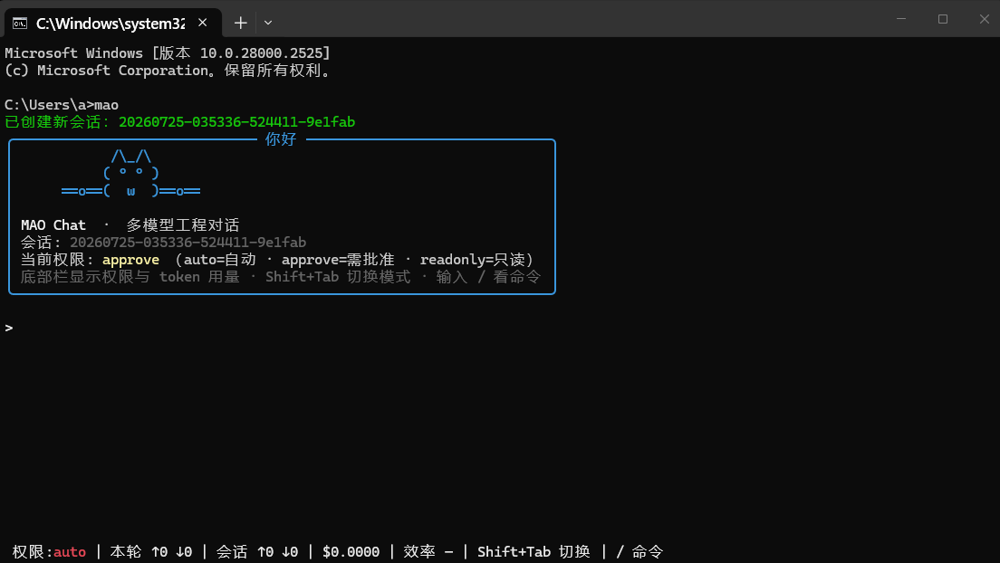
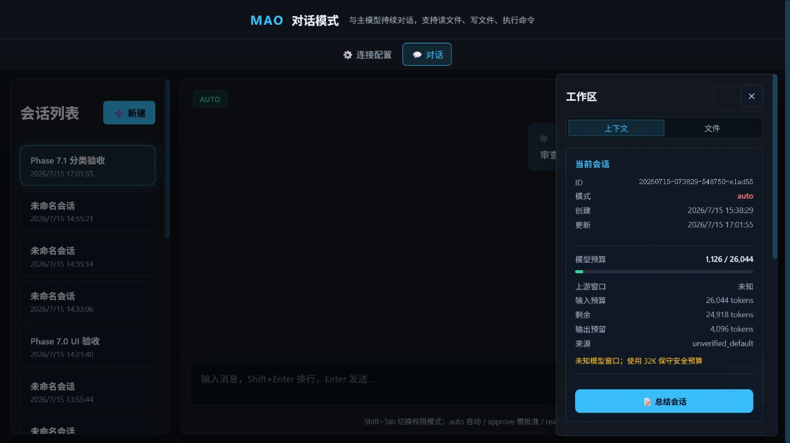
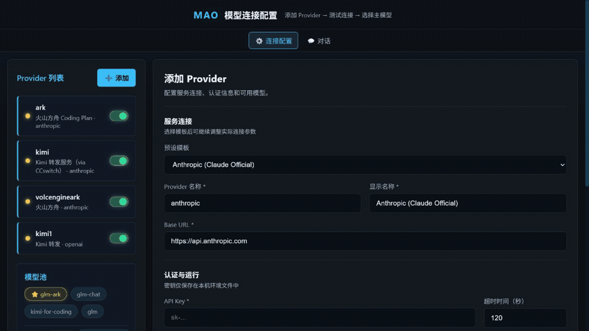

# MAO - Evidence-Driven Multi-Model Engineering Agent

```text
           /\_/\
          ( ° ° )
     ══o══(  ω  )══o══
```

<p align="center"><sub>CLI welcome cat: perched on the ledge, looking up at you · Run <code>mao</code> to meet it</sub></p>

[](https://github.com/Wanbinyu/multi-agent-orchestrator/actions/workflows/ci.yml)


MAO is for developers who need to connect multiple model services: it runs engineering tasks in the CLI and WebUI, and constrains model behavior with clear read/write boundaries, tool evidence, verification gates, and bounded Worker collaboration. The core goal is not simply more concurrency—it is to let you choose different model capabilities and costs while still knowing what the system did, why it can finish, and what risks remain.

The current public release is [`v0.1.0-beta.7`](https://github.com/Wanbinyu/multi-agent-orchestrator/releases/tag/v0.1.0-beta.7) (security patch on beta.6: fixes the P0 `run_command` inline code execution issue). Core contracts from beta.3–beta.6 are landed; next steps follow the v0.2.0 entry conditions. It is suitable for trial on trusted local machines and reviewable projects—not a full replacement for Claude Code, Codex, or a container sandbox.

## UI preview

### Terminal CLI (`mao`)

After launch you enter chat mode: welcome cat, session info, and a bottom bar showing permission mode and token usage (Shift+Tab cycles modes).



### WebUI (`mao web`)

Configure providers, chat, and context budget in the browser.



### 60-second real workflow demo



The demo walks through provider configuration, `approve` permission confirmation, constrained project structure and file reads, structured conclusions, and context budget, evidence, and engineering records for the turn in the workspace. The demo task is a read-only inspection and does not modify the target project.

## Why MAO

I built this tool to save tokens and make the most of what different models are good at.

Even as Claude and GPT quotas, plans, and context policies keep changing, many people still use other models because of cost, region, availability, or working habits. I myself struggled with tokens burning too fast, so I started routing work to more suitable models and keeping the whole process within clear boundaries, evidence, and verification. This is my first complete attempt at building an agent; the project still has rough edges. Feedback, suggestions, and treating it as an idea worth continuing are all welcome.

Tokens may one day be as common as water and electricity, but even when cost is no longer the main issue, different models will still have different strengths. A tool that can combine model capabilities, control spend, and keep engineering evidence still matters.

## One-command install and start

Requires Python 3.11 or 3.12. If you already have `pipx`, install from GitHub into an isolated environment:

```bash
pipx install git+https://github.com/Wanbinyu/multi-agent-orchestrator.git
```

After install, run from the project directory you want to inspect or change:

```bash
mao
```

`mao` opens terminal chat by default. On first run, if the current directory has no provider configuration, it starts the connection wizard. Config, sessions, and output stay in the current project directory and are never written into the Python install tree.

Start the WebUI:

```bash
mao web
```

The browser opens `http://127.0.0.1:8123` by default. On first use you can add a provider, test the connection, and pick a main model; keys are written only to `.env` in the current directory. The older `mao-ui` command remains compatible.

Upgrade or uninstall:

```bash
pipx upgrade multi-agent-orchestrator
pipx uninstall multi-agent-orchestrator
```

If you originally installed via Git URL, `pipx upgrade` keeps using that recorded Git source. After upgrading, check the version with `mao --version`.

Without `pipx`, install it first:

```bash
python -m pip install --user pipx
python -m pipx ensurepath
```

### Develop from source

```bash
git clone --depth 1 https://github.com/Wanbinyu/multi-agent-orchestrator.git
cd multi-agent-orchestrator
python -m venv .venv
# Windows: .venv\Scripts\activate
# Linux/macOS: source .venv/bin/activate
python -m pip install -e ".[test]"
python -m pytest -q
```

### Feedback and issue reports (please redact)

GitHub Issues for install problems, real project task results, or bugs are welcome. **Do not paste API keys, `.env` contents, sessions, or customer code.**

- Guide: [`docs/external-user-feedback-guide.md`](docs/external-user-feedback-guide.md)
- Issue templates: install feedback / real-task feedback / bug / provider compatibility
- Log sanitization: `python scripts/sanitize_feedback_text.py log.txt`
- Security vulnerabilities: use a [Security advisory](https://github.com/Wanbinyu/multi-agent-orchestrator/security/advisories/new), not a public issue

## Known limitations and security boundaries

- MAO has no container-level sandbox; commands run on the host with the current process privileges. Prefer `approve` by default; use `readonly` for untrusted projects. Permission rules and plugin enable gates are **application-level authorization**, not OS/container isolation.
- Provider auth, streaming, and native tool compatibility differ; dynamic model aliases may not expose accurate model versions or hard context windows.
- Unverified models default to a **200K** local safe budget (you can declare larger or smaller real windows in config). That number is MAO’s local guard, not an upstream physical limit; if the upstream window is smaller, the provider may still reject the request. `unverified` capabilities do not participate in automatic upgrades or savings claims.
- Automated CI does not call real paid models; real providers, multi-model collaboration, and summary quality still need manual smoke acceptance.
- MCP servers, hooks, and Python plugins all run with MAO process privileges—review configuration and source before enabling them.

Full security boundaries: [`SECURITY.md`](SECURITY.md). Provider capability matrix and error codes: [`docs/Provider-compatibility-matrix.md`](docs/Provider-compatibility-matrix.md). Current product direction: [`docs/MAO-product-direction-and-beta-roadmap.md`](docs/MAO-product-direction-and-beta-roadmap.md).

## Directory structure

```
multi-agent-orchestrator/
├── config/                   # Provider, Worker, and extension config for the current project
├── docs/                     # User, extension, roadmap, and release docs
├── src/
│   ├── cli/                  # Terminal interaction and first-run setup
│   ├── core/                 # Agent, Worker, scheduling, evidence, and context
│   ├── gateway/              # Provider routing, failover, and billing
│   ├── resources/            # Runtime templates bundled in the package
│   ├── tools/                # Files, commands, search, web, MCP, and hooks
│   └── ui/                   # FastAPI WebUI
├── tests/                    # Dev and CI tests; not included in wheel/release archives
├── run.py                    # `mao` command entry point
├── README.md
├── SECURITY.md
└── pyproject.toml
```

## Quick start

### 1. Install dependencies

```bash
pip install -r requirements.txt
```

### 2. Configure providers and the main model (recommended: graphical UI)

```bash
python scripts/run_ui.py
```

The browser opens `http://127.0.0.1:8123` automatically. The UI supports:

1. Choosing from 15+ common provider presets (Anthropic / OpenAI / DeepSeek / Volcengine Ark / Kimi / Zhipu GLM / custom, and more).
2. Pasting an API key and auto-filling base URL and default model mappings.
3. Clicking **Test connection** to see live connectivity status.
4. Enabling/disabling any provider; the model pool filters to models from enabled providers only.
5. Selecting the main model and saving.
6. Expanding the project tree on the chat workspace page and previewing text files read-only as needed.

Configuration is written to `config/providers.yaml` and `.env`, fully compatible with the CLI.

> If a browser is inconvenient, use the command-line wizard:
>
> ```bash
> python run.py agent-setup
> ```

### 3. Configure Worker roles (legacy wizard, optional)

```bash
python run.py setup
```

This wizard walks you through:

1. Choosing a scenario (software development / novel writing / game modding / software testing / custom)
2. Configuring the Orchestrator model
3. Configuring Worker names, models, and responsibilities
4. Generating `config/workers.yaml`

When no private `config/workers.yaml` exists, Orchestrator, Worker, and Reviewer fall back to the keyless `config/workers.yaml.example`. Local files still take priority and are not tracked by Git.

### 4. Run

```bash
python run.py "Build a frontend/backend login feature; React frontend, FastAPI backend"
```

Full command options:

```bash
python run.py "Build a login page" \
  --output output \
  --config config \
  --max-workers 4 \
  --orchestrator-model glm-ark
```

| Option | Short | Description |
|---|---|---|
| `--output` | `-o` | Output directory, default `output` |
| `--config` | `-c` | Config directory, default `config` |
| `--max-workers` | `-w` | Max concurrent Workers, default `4` |
| `--orchestrator-model` | `-m` | Override Orchestrator model at runtime |
| `--output-format` |  | `plain`, `json`, or `streaming-json`; the latter two emit headerless event streams |

> If no subcommand is given, `run.py` treats the first non-command argument as the `run` request.

For scripts and other automation, use machine-readable output:

```bash
mao run "Inspect the current project and report risks" --output-format json
mao run "Inspect the current project and report risks" --output-format streaming-json
```

`json` emits one JSON object with `run` and `events`; `streaming-json` emits JSONL line by line. Events cover plan, model, tools, file changes, commands, verification, approvals, usage, errors, and end status. Worker response bodies are not written into the event stream.

### 5. Enter continuous chat mode (CLI)

After connection setup, chat multi-turn with the main model from the terminal:

```bash
python run.py chat
```

Common REPL commands:

Type `/` in chat to show command candidates and descriptions; keep typing letters to filter live. Full list: `/help`.

| Command | Description |
|---|---|
| `/new [title]` | Create a new session |
| `/load <session_id>` | Load an existing session |
| `/save` | Manually save the current session |
| `/context` | Local view of model mapping, context budget, current estimate, and auto-compaction thresholds (no model call) |
| `/tree [path] [depth]` | Local project structure (no model call, no tokens) |
| `/plan <requirement>` | One-shot task plan via the Orchestrator |
| `/plan enter [goal]` | Enter persistent read-only Plan mode |
| `/plan show` | Show current plan, status, and revision |
| `/plan revise <feedback>` | Record revision feedback and generate a new plan version |
| `/plan approve` | Approve the plan and hand off to the normal multi-model execution chain |
| `/plan cancel` | Cancel Plan mode |
| `/collab <auto\|single\|multi>` | Default single Agent; `multi` forces collaboration; `auto` only collaborates on deep change/build |
| `/status` | Local session snapshot: permission, model, depth, collaboration, tokens, last verification, recovery |
| `/checkpoint` | Create/list/preview/restore/prune a workspace snapshot that never writes `.git`; `/checkpoint auto off` disables write-ahead snapshots |
| `/tools` | Show currently available tools |
| `/exit` | Exit |

Chat artifacts are stored under `sessions/<session_id>/output/`.

Assistant replies stream **chunk by chunk in a bounded temporary region**, then write the final body once into the terminal scrollback so long answers do not leave repeated cumulative render frames in the console. Project analysis and tool work are shown in stages (“explore project / search code / generate deliverables / run verification”); each stage expands only the first 4 items, folds later similar operations, and summarizes directories, files, searches, repeated operations, and failures at the end. After tools run, the full final answer still appears in the console—you do not need to open `response.md` manually to see the conclusion.

The agent system prompt injects the current model alias, upstream request model ID, local context budget, and auto-compaction thresholds. Config name `anthropic` means a compatible protocol, not that the actual model is Claude. Use `/context` for live estimates; do not let the model guess runtime configuration.

Each request is classified as Q&A, explanation, diagnosis, change, build, review, plan, or monitoring; type, risk, and write status go into the engineering log. `auto` opens write and command tools for unclassified or writable tasks; `approve` auto-reads but requires confirmation for each write or command; `readonly` auto-reads and rejects writes and commands. Explicit boundaries such as “read-only, do not modify, plan only” always take priority in every mode—the classifier does not override a user’s no-modify requirement because of `auto`. If real tool behavior diverges from the initial classification, RunJournal keeps the original permission boundary while computing a stricter effective type and verification gate from actual project writes; auto-archived `response.md` does not count as a project change.

`/checkpoint` stores a file snapshot beside the session, not in your Git history. The first write in a run creates one automatic snapshot unless you run `/checkpoint auto off`. Preview the diff, then `/checkpoint restore <id> confirm`. Uncommitted files are not overwritten unless you also pass `overwrite-dirty`. Old snapshots are pruned by count and size (`/checkpoint prune`).

Small questions, diagnoses, and ordinary edits stay on the single-Agent path. Multi-model collaboration starts only for `deep` change/build work, after `/collab multi`, or when `config/workers.yaml` sets `collaboration.force: true`. `/collab single` keeps Orchestrator off. Writes must be followed by real tests; a failed verification can be patched at most three times (`MAO_MAX_FIX_ROUNDS`) and then stays `blocked`.

Execution depth defaults to `auto`; you can persist `/depth fast`, `/depth standard`, `/depth deep`, or `/depth auto` in the CLI. `fast` fits simple Q&A and clear small tasks and disables Workers; `standard` covers routine diagnosis, changes, and review; `deep` covers builds, high risk, and multi-model collaboration. User choice outranks automatic suggestion; choosing `fast` for a small change still keeps the `standard` verification gate, and high-risk work cannot drop to shallow execution. Actual depth, reason, and budget are written to RunJournal.

Model routing defaults to `auto`, choosing the turn’s model from task type, execution depth, explicit capability truth, traceable price, context, and health. `/routing fixed` pins the configured main model; `/routing auto` restores automatic selection. Unverified capabilities never trigger upgrades; unknown prices never produce savings claims. After automatic candidates fail, prefer falling back to the user’s main model. CLI/Web show a short reason; RunJournal v5 keeps the full candidate audit.

Project inspection first obtains a compact structure and read-only Git status, then samples docs, dependencies, entry points, core code, and tests within bounds. Real tool results are written into traceable Evidence automatically; cached reads do not double-count evidence. CLI/Web run records show evidence counts and project recon coverage for the turn.

Engineering changes run a deterministic completion audit before finish: ordinary changes need targeted tests and adjacent-module regression; high-risk builds also need integration, full, and smoke verification. Without direct evidence the run status stays `blocked` and the final reply lists verification gaps. Reviewer model output cannot override that audit.

Project verification uses `discover_project_commands` to read real npm/pnpm/yarn/Python commands, then runs them via `run_command` with an independent `cwd`. Commands are not shell-concatenated; `cd &&`, pipes, and redirects are rejected. Traces record arguments, cwd, exit code, duration, and truncation. Vite builds may use an auto-cleaned temporary output directory; argument or permission failures get at most one correction attempt.

Multi-model collaboration tasks declare read-only/write/verify mode, dependencies, acceptance criteria, parallel safety, and shared absolute path ownership. Worker relative writes are isolated in separate directories; out-of-bounds writes are rejected. Transient failures retry only the target task; tool and verification results from every attempt enter the main engineering log.

MAO loads `AGENTS.md`, `CLAUDE.md`, and `.mao/rules/*.md` hierarchically from the target project, and is compatible with Grok/Claude/Cursor rule directories; source and truncation diagnostics go to RunJournal. User-level `config/permissions.yaml` and project-level `.mao/permissions.yaml` support `deny / ask / allow`, always deciding `deny > ask > allow > session default`. Main Agent and Workers share the same engine. Rules may use `justification` for rationale and `match` / `not_match` examples for load-time self-checks; failed rules are ignored and reported as diagnostics. See `config/permissions.yaml.example`.

Persistent Plan mode forces full-chain read-only until approval. After the main agent obtains real recon evidence, four model roles—evidence check, architecture planning, risk review, and final synthesis—form a single plan; helper models get no tools. Historical design notes: [`docs/archive/completed-beta/Grok-Build-behavior-contract-integration.md`](docs/archive/completed-beta/Grok-Build-behavior-contract-integration.md). Current optimization order: [`docs/MAO-optimization-and-follow-up-plan.md`](docs/MAO-optimization-and-follow-up-plan.md).

Context work continues along “model window truth → dynamic safe budget → layered compaction → persistent project context → long-task benchmarks”; details in [`docs/context-extension-and-long-task-stability-plan.md`](docs/context-extension-and-long-task-stability-plan.md). Unverified models use a local default safe budget of **200K** (not an upstream physical limit claim).

Public `v0.1.0-beta.7` (security patch) fixes the P0 where `run_command` allowed `python -c` / `node -e` inline code execution. beta.6 completed controlled Plugin API v0: discovery via `mao.plugins` entry points, default-off with explicit enable, API version constraints, isolated load failures, `mao plugin list/doctor/enable/disable`, example plugin, and Web visibility; Windows/Ubuntu, Python 3.11/3.12, and security CI all pass. beta.3–beta.5 delivered trusted provider onboarding, engineering transparency, session recovery, layered compaction, project index, model routing, reproducible benchmarks, and adversarial testing. Real multi-model comparison is paused after cumulative authorization was exhausted and resumes only when the owner sets new count and cost bounds. Plugin development: `examples/plugins/mao_wordcount_plugin`. Completed version plan archive: [`docs/archive/completed-beta/version-plan-v0.1.0-beta.3-to-beta.6.md`](docs/archive/completed-beta/version-plan-v0.1.0-beta.3-to-beta.6.md).

The public offline B5 contract can be run with `python scripts/benchmark_engineering.py`. In an isolated workspace it runs fixed single-model, auto-routing, and multi-model fixture strategies three times each across six programmatic task types (54 results total), never reading keys or calling providers. Output is synthetic contract data and does not represent real model quality.

### 6. Open the Web chat page

```bash
python scripts/run_ui.py
```

Open `http://127.0.0.1:8123/chat` in the browser:

- Desktop emphasizes the main chat area by default; the context panel expands on demand. On mobile, the session list is a horizontal strip and context uses a drawer.
- The config page groups “service connection / auth & runtime / model mapping”; on mobile, model mapping switches to vertical cards.
- The main message area supports **SSE streaming**; assistant replies appear token by token while the input stays in view.
- Supports Markdown, code blocks, tool results, and generated file display.
- The main model can call `read_file` / `write_file` / `run_command` tools automatically.
- The legacy sync API `POST /api/chat/sessions/{id}/messages` remains; streaming uses `POST /api/chat/sessions/{id}/messages/stream`.
- The top **Plan** control enters full-chain read-only planning; after viewing a plan you can revise, approve and implement, or cancel. State persists with the session.

### 7. Switch the Orchestrator model

The default Orchestrator is set in `config/workers.yaml` under `orchestrator.model`. The sample config defaults to `glm-ark` (your connected Volcengine Ark model).

**Option 1: Runtime override**

```bash
python run.py "Build a login feature" --orchestrator-model glm-ark
```

**Option 2: Change the default config**

Edit `config/workers.yaml`:

```yaml
orchestrator:
  model: glm-ark
```

> Note: the Orchestrator splits tasks and accepts work—stronger models split more accurately. Cheaper models can be the Orchestrator, but plan quality may drop.

### 8. Manual configuration (optional)

If you prefer not to use the wizard, create `.env` yourself:

```env
ANTHROPIC_API_KEY=your Anthropic Key
OPENAI_API_KEY=your OpenAI Key
GLM_API_KEY=your Zhipu Key
DEEPSEEK_API_KEY=your DeepSeek Key
ARK_API_KEY=your Volcengine Ark Key
```

And edit `config/providers.yaml` and `config/workers.yaml`.

## Worker tools

Workers can use these tools while executing tasks:

- **write_file / edit_file**: create or precisely edit files with explicit paths
- **project_tree / read_file / list_dir / glob_files / grep_content**: constrained project tree, file reads, directory probes, and content search; absolute paths supported
- **run_command**: run allowlisted commands
- **web_search / fetch_url**: web search and URL fetch
- **search_project_files / search_memory**: project index and long-term memory retrieval

Tool calls support native `tool_use` and a ```` ```tool:xxx ```` Markdown fallback. Collaboration Workers return tool results to the model and continue for up to 5 rounds.

Project files must be created via `write_file` with an explicit filename—no more `generated_N` files from body code blocks. Plain-text results still fall back to `output/<type>_<id>/content.txt`.

## Currently supported models

- **Anthropic**: Fable 5 / Opus 5 / Sonnet 5 / Haiku 4.5
- **OpenAI**: gpt-5.6-sol / gpt-5.6-terra / gpt-5.6-luna
- **Zhipu GLM**: glm-5.2 / glm-5
- **DeepSeek**: deepseek-v4-pro / deepseek-v4-flash
- **Kimi Coding Plan**: `k3` / `k3-256k` / `kimi-for-coding` / `kimi-for-coding-highspeed`
- **Alibaba Qwen**: qwen3.8-max-preview / qwen3.7-max / qwen3.7-plus / qwen3.7-flash
- **MiniMax**: minimax-m3
- **ByteDance Doubao**: doubao-seed (Volcengine Ark OpenAI-compatible)
- **Google Gemini**: gemini-3.6-flash / gemini-3.5-flash-lite (OpenAI-compatible endpoint)
- **Local models**: Ollama / llama.cpp (see `config/providers.yaml.example`)
- **Custom OpenAI / Anthropic-compatible services**: configure via `agent-setup`

> Actually available models depend on `config/providers.yaml`. `src/models/catalog.py` is the single source of truth for built-in model templates; CLI and Web presets are generated from the catalog. Unverified entries keep `unverified` metadata; prices are placeholders only.

The MAO gateway injects a short global behavior profile into all ordinary chat requests—main chat, planning, Worker, and Reviewer. It is tailored to MAO’s tools, permissions, and acceptance flow, not a verbatim copy of any vendor web UI system prompt. Web UI prompts include UI-specific tools and product context and are not suitable to send to the API as-is. `ModelConfig.prompt_profile` is reserved for future model-specific extensions only.

## Current features

- [x] Configurable model automatic task splitting
- [x] **Scenario-aware orchestration**: novels generate sequentially; software does architecture first, then parallel development
- [x] **Dependency task output injection**: downstream tasks automatically receive prior task outputs
- [x] Runtime Orchestrator model switching
- [x] Multi-model concurrent execution
- [x] Task dependency DAG scheduling and failure cascading
- [x] Worker multi-round tool calls and tool permission checks
- [x] Multi-layer model failover, health cooldown, and CLI/Web notifications
- [x] Hooks, MCP stdio/SSE adapters, and local LLM providers
- [x] Auto-save code blocks to the output directory
- [x] Provider connection wizard and connectivity tests
- [x] Model aliases and Provider `model_map`
- [x] **Graphical model connection UI** (FastAPI + browser)
- [x] Common provider preset one-click fill and extension
- [x] Provider enable/disable with automatic model pool filtering
- [x] API keys stored in local `.env`; leave blank on edit to keep unchanged
- [x] Connectivity test status persisted across page refresh
- [x] Multi-key rotation
- [x] Token billing and cost statistics
- [x] Failure retry with exponential backoff
- [x] Windows console UTF-8 auto adaptation
- [x] Auto-save `content.txt` when there are no Markdown code blocks
- [x] Multi-turn session persistence (YAML)
- [x] Chat agent tool loop (up to 5 rounds)
- [x] CLI continuous chat REPL (`python run.py chat`)
- [x] Web chat page (`/chat`)
- [x] Web project file tree: lazy-loaded directories, hidden-file toggle, constrained text preview
- [x] **Streaming answers**: Web and CLI both support chunked output (SSE)
- [x] Multi-round stream concatenation under tool-loop scenarios

## Running tests

See [TESTING.md](TESTING.md).

## Roadmap

First close out docs, U4 boundaries, provider compatibility, and real-user validation per [`docs/MAO-optimization-and-follow-up-plan.md`](docs/MAO-optimization-and-follow-up-plan.md), then move into further feature work. Product principles: [`docs/MAO-product-direction-and-beta-roadmap.md`](docs/MAO-product-direction-and-beta-roadmap.md). Current status: [`docs/project-progress-and-key-operations.md`](docs/project-progress-and-key-operations.md).
