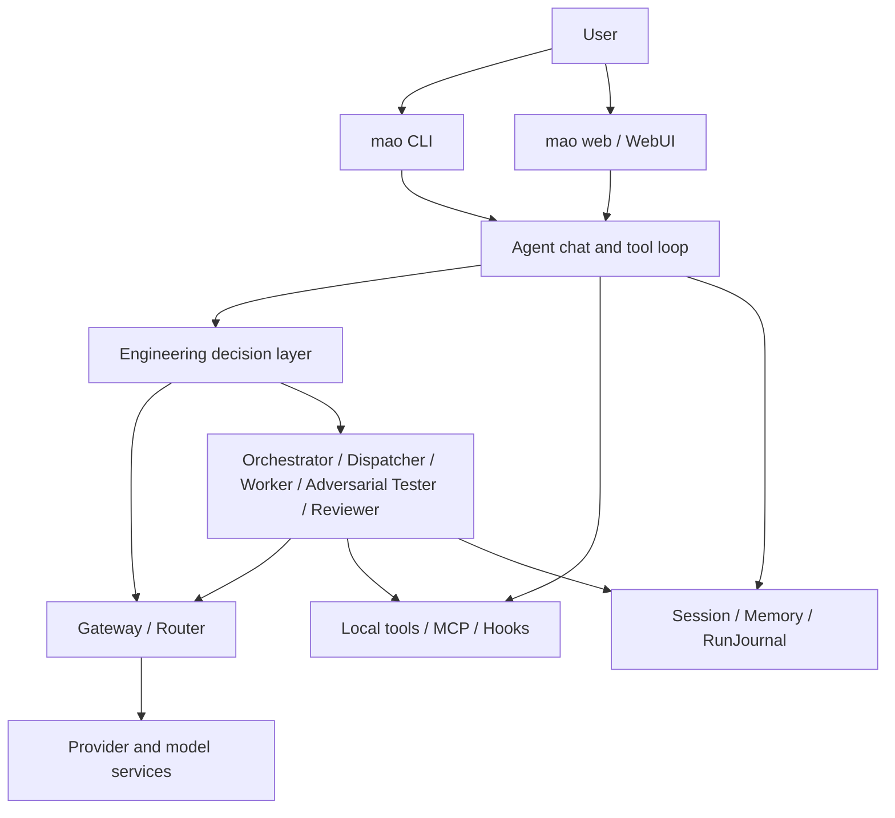

# MAO Architecture Overview

**Applies to**: `v0.1.0-beta.7` and later Beta releases

**Last updated**: 2026-07-21

This document describes the architecture and boundaries that actually exist in the current code. Historical stage designs have been moved to `docs/archive/` and are no longer treated as implementation truth.

## 1. Product boundary

MAO is a locally run, self-hostable multi-model engineering Agent. It connects multiple model services, runs constrained engineering tools, decomposes complex tasks, preserves Evidence, and runs deterministic audits before completion.

MAO is not the model itself, and it does not try to break upstream model context limits. Its goal is not “call more models,” but the following outcomes:

- Choose an appropriate model based on task, capability, cost, and availability.
- Control cost from tokens, context, and failure retries.
- Let users see plans, tools, Evidence, verification, and remaining risk.
- Never mark a task complete without direct Evidence.

## 2. Overall structure

## 3. Entry points and workspace

- `mao`: Enters terminal chat by default; starts the Provider configuration wizard on first run.
- `mao web`: Starts the local WebUI; the configuration page still opens when no Provider is configured.
- `mao run`: Runs a one-shot orchestration task.
- `mao-ui`: Retained compatibility entry point.

Commands treat the current directory as the project workspace. `config/`, `sessions/`, `memory/`, and output files are written into the current project, not into the Python install directory.

Primary entry points:

- `run.py`
- `src/cli/chat_command.py`
- `src/ui/cli.py`
- `src/ui/app.py`

## 4. Model gateway

`GatewayClient` is the unified entry point for model calls and is responsible for:

- Loading Provider and model mappings.
- Selecting the main model or a designated Worker model.
- Recording input/output tokens and estimated cost.
- Performing model failover when configuration allows.
- Unifying streaming and non-streaming response formats.

The Provider layer currently covers the Anthropic protocol, OpenAI-compatible protocols, Ollama, and llama.cpp. Local logical model names are separated from upstream real model IDs so protocol names are not mistaken for actual model names.

Anthropic tool turns maintain three content layers at once: string body text for the UI and older Providers; persistable safe blocks of `text`/`tool_use`/`tool_result`; and process-local Provider-private blocks. Private blocks hold protocol state such as thinking/signature and are force-excluded from Pydantic serialization; tool results must carry the original `tool_use_id` and appear before any following text in the same user message. Models without structured tools continue to fall back to Markdown tool blocks.

Context compaction never separates a native `tool_use` from the immediately following `tool_result`; context budget is estimated from the native payload that is actually sent, not only from display text.

Provider exceptions are classified in `src/gateway/errors.py` into safe-to-display `ProviderError` values. The error contract decides error code, operational guidance, whether to retry, whether failover is allowed, and HTTP/SSE representation; Gateway no longer concatenates raw SDK exceptions for users. Each request’s redacted attempt trail is turned by the Agent into RunJournal Evidence, recording attempt count, error codes, attempted models, and the final model.

Key modules:

- `src/gateway/client.py`
- `src/gateway/errors.py`
- `src/gateway/provider.py`
- `src/gateway/local_provider.py`
- `src/gateway/router.py`
- `src/models/catalog.py`
- `src/models/schemas.py`

## 5. Agent and engineering decision layer

`Agent` owns multi-turn conversation, streaming output, the tool loop, permission requests, and collaboration triggers. Outside model output, the engineering decision layer maintains deterministic state:

- `TaskIntent`: Task type, risk, write authorization, and verification depth when the request enters the system.
- `ExecutionDepthDecision`: Requested, recommended, and actual values for `fast/standard/deep`, selection reason, and execution budget.
- `ModelRoutingDecision`: User main model, actual model, routing source, capability/context/health/price judgments, and full candidate audit.
- `ObservedMutation / effective_intent`: Dynamically tightens risk and completion audit based on real writes; separated from the initial permission intent and cannot expand this turn’s tool permissions.
- `WorkPlan`: Plan steps with state constraints.
- `Evidence`: Evidence from real tools, files, tests, or run state.
- `Hypothesis`: Must be bound to Evidence before being marked supported or refuted.
- `VerificationGate`: Targeted, adjacent, integration, full, and smoke verification.
- `RequirementCheck`: Mapping among user requirements, implementation Evidence, and verification Evidence.
- `CompletionAudit`: Decides whether a task may truly end.
- `RunJournal`: Persistent record of a single run turn.

A model-generated “completed” claim cannot override a deterministic audit failure.

Delivery summaries no longer depend on compacted conversation messages. `DeliveryReportBuilder` aggregates create/modify/verify/todo/user-step/risk facts with provenance from this session or all of today’s RunJournal entries, and statistics for duty-model tokens/cost, success rate, first-pass runnable rate, rework, misdiagnosis, and tokens per effective delivery. CLI `/report`, Web engineering summary, and explicit natural-language report requests share the same zero-Provider path.

Key modules:

- `src/core/agent.py`
- `src/core/native_content.py`
- `src/core/engineering/classifier.py`
- `src/core/engineering/execution_depth.py`
- `src/core/engineering/evidence.py`
- `src/core/engineering/verifier.py`
- `src/core/engineering/audit.py`
- `src/core/engineering/journal.py`
- `src/core/engineering/benchmark.py`
- `src/core/engineering/benchmark_agent.py`
- `src/integrations/harbor_agent.py`
- `src/gateway/router.py`

`ExecutionDepthResolver` automatically recommends an execution tier from task type, risk, and verification depth, and also accepts an explicit session-level choice. Explicit choice cannot go below the safety floor; effective intent after real writes re-tightens execution depth. The three tiers deterministically constrain main Agent/Worker tool rounds, context ratio, Worker concurrency, collaboration Reviewer, and change-verification floor, but do not participate in authorization decisions and cannot expand tool permissions.

`ModelRouter` performs one bounded selection before the call: task type and execution depth determine required capabilities; only explicitly `supported` capabilities may drive automatic upgrade; price, context, and health must come from local configuration truth. Unknown price cannot form a savings conclusion; automatic upgrade happens at most once; `fixed` mode always uses the user’s main model. Routing failure first falls back to the user main model, then enters Gateway’s existing runtime retry/failover; the two layers of reasons are recorded separately.

`EngineeringBenchmarkHarness` copies versioned task contracts into per-strategy, per-round isolated workspaces; all strategies share response, file, verification-command, and out-of-bounds mutation acceptance. Reports independently store model set, routing, execution depth, and collaboration profile. `FixtureBenchmarkStrategy` only validates harness contracts and marks data as `synthetic_contract`; it does not read Provider configuration and cannot serve as evidence of real model quality.

`benchmark_agent.py` enters the production streaming Agent chain from a new Session and does not substitute the old `mao run`. `MaoLiveBenchmarkStrategy` runs real strategies through the same harness, but construction requires owner-confirmed `LiveBenchmarkAuthorization`; all three strategies share `LiveBenchmarkSpendGuard`. `allowed_models` limits Router candidates, Worker fallback, and failover before calls. `harbor_agent.py` is an optional Harbor `BaseInstalledAgent` boundary and is not part of default runtime dependencies.

`AdversarialTester` is an experimental read-only role that is off by default. It runs only on explicitly enabled `deep change/build` collaboration after all Workers succeed and the deterministic completion audit has already passed; it receives only the original requirement and direct engineering Evidence, not Worker reply bodies, and holds no tools. Its structured conclusions can only maintain or lower completion confidence: `refuted` downgrades the result to blocked, `inconclusive` records residual risk, and no conclusion can upgrade a failed or unverified result to completed.

## 6. Multi-model collaboration

Complex tasks may enter the collaboration path:

1. `Orchestrator` generates dependent subtasks.
2. `Dispatcher` validates dependencies and path ownership and schedules under safety conditions.
3. `Worker` works under explicit tools, model, execution mode, and acceptance criteria.
4. When an explicit experimental tier meets conditions, `AdversarialTester` read-only attempts to overturn already-passed implementation conclusions.
5. `Reviewer` aggregates results but cannot bypass engineering audit or adversarial counterexamples.

Reviewer defaults to `restricted` input mode: it only reads the original requirement, plan contract, duty status, file list, and direct Evidence/Verification/Requirement/Audit—not Worker output bodies; `workers.yaml` may explicitly switch to `full`. Actual mode is written to RunJournal collaboration metrics; no mode can override a failed Worker or deterministic audit.

Project-level high-risk frontend builds use an additional structured contract: Orchestrator always splits into four Worker stages—architecture/scaffold, pages, data/API, and integration—with Reviewer as a fifth duty. The contract declares project root, entry, route targets, npm dependencies, per-task ownership, verification commands, and smoke paths. The integration Worker runs only after all implementation dependencies succeed and deterministically checks files, dependencies, and relative import closure before returning success; every verification command must come from a real successful tool trail—Worker body text cannot serve as verification Evidence. Duties and actual models are written to RunJournal `metrics.collaboration`.

Collaboration boundaries include:

- Subtask dependency and cycle detection.
- Shared absolute path ownership via `owned_paths`.
- Relative write isolation directories.
- `parallel_safe` parallel-safety declarations.
- Target-task retry only for transient failures.
- Worker tool trails reclaimed into the main RunJournal.

Key modules:

- `src/core/orchestrator.py`
- `src/core/dispatcher.py`
- `src/core/worker.py`
- `src/core/adversarial_tester.py`
- `src/core/reviewer.py`
- `src/core/collaboration.py`
- `src/core/frontend_contract.py`

## 7. Tools and permissions

Tools are registered uniformly by `ToolRegistry`, supporting Markdown tool blocks and native tool use for some models. Tool sources include built-in tools, contribution modules, and MCP.

Project commands are first discovered from actual configuration by read-only `discover_project_commands`. `run_command` uses an independent, normalized cwd and argument array with fixed `shell=False`; inline `cd`, pipes, and redirects are rejected. Each execution records argv, cwd, exit code, duration, output truncation, and permission decision. Vite builds may use auto-cleaned temporary output; precheck failures allow at most one corrective attempt and do not count as a test verification gate.

High-risk frontend integration additionally uses `frontend_smoke`. It starts a loopback dev/preview server from the structured contract, auto-selects a dynamic port and manages the process tree, then uses Playwright at desktop/mobile viewports to check login, routes, data/canvas, console/page error, horizontal overflow, and declarative occlusion. Browser results directly produce smoke Evidence and VerificationGate; missing browser, server timeout, or any assertion failure cannot be overridden by model body text.

The stability release gate is offline-replayed by `StabilityReplayRunner` using a public redacted smart-mining fixture. It chains classification, four-duty frontend contract, closure, real commands, browser smoke, completion audit, and delivery report into one deterministic chain; the good sample must complete, broken Mock and missing-route samples must be blocked, and Provider calls are fixed at 0. CI runs the same script so cross-layer contracts are not missed by testing only single modules.

Optional Hook/MCP extensions use an in-process idempotent loader. Missing configuration is silently skipped; a single bad entry does not block valid entries or core startup. Load results retain at most 10 redacted diagnostics containing only stable error codes, fixed descriptions, operational guidance, config filename, entry index, and exception type—not exception text, full paths, command arguments, or environment variables. CLI startup shows a short summary; Web exposes independent status via `/api/diagnostics/extensions`; optional extension failure does not make `/health` unhealthy.

Plugin API v0 (`src/plugins/`) unifies tools, ToolSource, Hooks, Provider presets, and model capability data into a diagnosable, version-constrained extension interface that must be explicitly enabled. Plugins are discovered via the standard Python entry point group `mao.plugins` (workspace is not scanned); `PluginManifest` declares id/version/`mao_api_version`/capabilities/permissions; plugins are off by default and loaded in isolation by `PluginManager` at startup after the user explicitly enables them in `config/plugins.yaml`. `PluginContext` records every contribution from each plugin; on load failure or disable, `rollback` revokes them without affecting other plugins or plugin-free startup; `shutdown` unregisters contributions and closes resources. `MAO_PLUGIN_API_VERSION="0.1"`; incompatible versions are rejected. Python plugins are trusted local code with the same process privileges as MAO; permissions are only a consent surface and do not constitute an OS/container sandbox (they are application-level authorization only); external tools still prefer MCP process boundaries. CLI `mao plugin list/doctor/enable/disable` and Web `GET /api/plugins` plus the chat “Plugins” read-only tab expose the plugin inventory and permissions.

Permissions have two layers:

- Session modes: `auto`, `approve`, `readonly`.
- Task policy: Q&A, explain, diagnose, review, and design stay read-only; change and build follow session mode; requests that cannot be classified stably hand tool availability to session mode, but are not thereby disguised as change tasks that need engineering verification.

This has been extended to a four-layer decision: explicit task/Plan hard boundary → user and project permission rules → session mode defaults → tool execution. Permission rules are implemented uniformly in `src/core/permission_rules.py` with priority `deny > ask > allow`; path normalization and compound-command segmentation happen before execution. Main Agent and Worker share the same instance; Orchestrator cannot expand permissions by splitting tasks.

`auto` executes tools directly for write-allowed or unclassified requests; `approve` auto-executes reads and issues a permission request for each write, command, and other non-read-only tool; `readonly` auto-executes reads and rejects all non-read-only tools. Explicit “no modification, read-only, design only” task boundaries take priority over session mode. `permission_follows_session` only governs tool availability; `allow_project_writes` continues to govern engineering change audit; the two must not be re-merged into one switch.

Key modules:

- `src/tools/registry.py`
- `src/tools/worker_tools.py`
- `src/tools/search_tools.py`
- `src/tools/web_tools.py`
- `src/tools/mcp_adapter.py`
- `src/tools/extensions.py`
- `src/tools/extension_diagnostics.py`
- `src/core/hooks.py`
- `src/core/permission_rules.py`
- `src/core/project_rules.py`
- `src/plugins/api.py`
- `src/plugins/manager.py`
- `src/plugins/runtime.py`

## 8. Session, context, and memory

- `SessionStore` saves multi-turn messages and session settings.
- `Session` persists Plan state and artifacts; until approved, the entire call chain is read-only.
- `SessionRecoveryManager` detects running/blocked/incomplete plans from the latest RunJournal; CLI/Web block new messages until explicit continue or abandon. Continue only hands unfinished step checkpoints to a new run; the old run, completed steps, and existing files are not automatically replayed.
- `RunJournal` v5 stores each turn’s initial/effective intent, execution depth, full model routing decision, observed real writes, plan, Evidence, verification, and audit; v3/v4 records remain backward compatible.
- `MemoryStore` stores stable project facts, separated from task checkpoints.
- `ProjectIndexer` v2 persists directory tree, file summaries, and SHA-256 by project root; zero content reads when mtime/size are unchanged; changed files use hash to decide whether to rebuild summaries. `project_tree` and `search_project_files` prefer incremental refresh; corrupt or cross-root indexes rebuild automatically.
- `ContextBudgetManager` computes budget from model window, output reserve, and safety ratio.
- `ContextCompactor` forms L0 old-summary artifact references, L1 structured summary, and L2 recent full text when thresholds are reached; plain-text dedup does not touch native tool blocks; Schema/entity quality and related token metrics enter compaction events. The current RunJournal fixed checkpoint is saved independently of the summary.
- `DeliveryReportBuilder` aggregates session/today delivery facts and token efficiency from all local RunJournal entries, without depending on compacted messages or calling a Provider.

Unknown models continue to use a conservative budget and mark the source as unverified; MAO does not guess the real context window behind Coding Plan packages.

## 9. WebUI

WebUI uses FastAPI, Jinja2, and native JavaScript/CSS with no frontend build chain. It currently includes:

- Provider configuration, presets, and connection tests.
- Session management, streaming chat, and permission confirmation.
- Project file tree and restricted text preview.
- Collaboration task status and engineering run summary.
- Context budget and memory sidebars.
- Persistent Plan status strip, revision, approve-to-implement, and cancel controls.
- Session-level adversarial testing switch (off by default) and structured completion status hints.

Plan drafts are first scouted by the main Agent with real read-only reconnaissance, then handed to `PlanningCouncil`’s four tool-less roles: evidence/architect/critic/synthesizer. All roles receive the same project rules, permission summary, and Evidence boundary; failed roles may only leave diagnostics and cannot forge Evidence or override a stable draft.

## 10. Architecture constraints that must be preserved

Later development must not break these constraints:

1. Do not expand write scope without user authorization.
2. Do not automatically roll back the user’s existing Git changes.
3. Model body text cannot forge tool Evidence or test results.
4. Tasks stay `blocked` when required verification is missing.
5. Unconfirmed model windows must not be shown as official truth.
6. Secrets, Session, and private Provider configuration must not enter Git.
7. Multi-model parallelism must have dependency and path-ownership boundaries.
8. Plan mode must constrain the main Agent, MCP, shell, and all Workers at the execution boundary—not only by hiding tools.

## 11. Current major gaps

- Automatic routing has offline contracts and mock execution Evidence, but no authorized real-model outcome data yet; cost or completion-rate advantages must not be marketed from this.
- B5.1 has only programmatic offline benchmark contracts; there is no authorized real Provider comparison data yet.
- The Provider compatibility matrix exists, but most non-Anthropic presets remain `unverified`; real smoke and multi-model outcome data have not been authorized.
- Tool execution has no container-level sandbox; application-level hardening exists (sensitive paths, interpreter inline/preload rejection, `fetch_url` intranet/SSRF protection)—see `src/tools/safety_guards.py` and `SECURITY.md`.
- Real-task token savings, completion rate, and mis-modification rate still lack public benchmarks.

These gaps are prioritized in [`MAO-product-direction-and-beta-roadmap.md`](MAO-product-direction-and-beta-roadmap.md).
