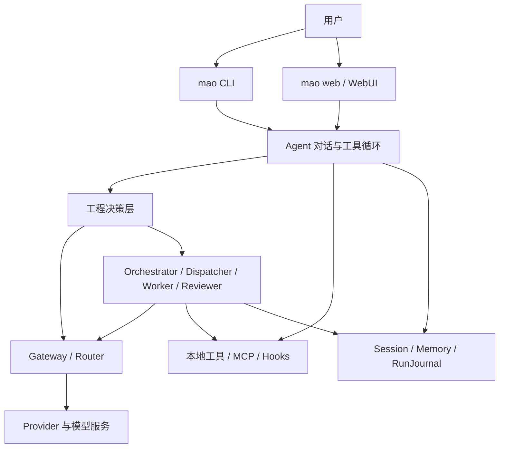

# MAO 架构概览

**适用版本**：`v0.1.0-beta.2` 及后续 Beta

**更新日期**：2026-07-16

本文描述当前代码中实际存在的架构和边界。历史阶段设计已移入 `docs/archive/`，不再作为实现真值。

## 1. 产品边界

MAO 是本地运行、可自托管的多模型工程 Agent。它负责连接多个模型服务、执行受约束的工程工具、拆分复杂任务、保存证据并在完成前执行确定性审计。

MAO 不是模型本身，也不试图突破上游模型的上下文限制。它不以“调用更多模型”为目标，而以以下结果为目标：

- 根据任务、能力、成本和可用性选择合适模型。
- 控制 token、上下文和失败重试带来的成本。
- 让用户看到计划、工具、证据、验证和剩余风险。
- 没有直接证据时不把任务标记为完成。

## 2. 总体结构

## 3. 入口与工作区

- `mao`：默认进入终端对话；首次运行时启动 Provider 配置向导。
- `mao web`：启动本地 WebUI；无 Provider 配置时仍可打开配置页。
- `mao run`：执行一次性编排任务。
- `mao-ui`：保留的兼容入口。

命令以当前目录作为项目工作区。`config/`、`sessions/`、`memory/` 和输出文件均写入当前项目，不写入 Python 安装目录。

主要入口：

- `run.py`
- `src/cli/chat_command.py`
- `src/ui/cli.py`
- `src/ui/app.py`

## 4. 模型网关

`GatewayClient` 是模型调用统一入口，负责：

- 加载 Provider 和模型映射。
- 选择主模型或指定 Worker 模型。
- 记录输入、输出 token 和估算成本。
- 在配置允许时执行模型故障切换。
- 统一流式与非流式返回格式。

Provider 层当前覆盖 Anthropic 协议、OpenAI 兼容协议、Ollama 和 llama.cpp。本地逻辑模型名与上游真实模型 ID 分离，避免把协议名误认为实际模型名。

Anthropic 工具回合同时维护三层内容：面向 UI 和旧 Provider 的字符串正文、可持久化的 `text`/`tool_use`/`tool_result` 安全块，以及仅在当前进程内回传的 Provider 私有块。私有块用于保存 thinking/signature 等协议状态，Pydantic 序列化时强制排除；工具结果必须携带原始 `tool_use_id` 并排在同一用户消息的后续文本之前。不支持结构化工具的模型继续使用 Markdown 工具块兜底。

上下文压缩不会把原生 `tool_use` 与紧随其后的 `tool_result` 分开；上下文预算按真正发送的原生载荷估算，而不是只统计展示文本。

关键模块：

- `src/gateway/client.py`
- `src/gateway/provider.py`
- `src/gateway/local_provider.py`
- `src/gateway/router.py`
- `src/models/catalog.py`
- `src/models/schemas.py`

## 5. Agent 与工程决策层

`Agent` 负责多轮对话、流式输出、工具循环、权限请求和协作触发。工程决策层在模型输出之外维护确定性状态：

- `TaskIntent`：任务类型、风险、写入授权和验证深度。
- `WorkPlan`：带状态约束的计划步骤。
- `Evidence`：来自真实工具、文件、测试或运行状态的证据。
- `Hypothesis`：必须绑定证据才能标记为支持或反证。
- `VerificationGate`：针对性、相邻、集成、全量和 smoke 验证。
- `RequirementCheck`：用户要求、实现证据和验证证据的映射。
- `CompletionAudit`：决定任务是否真的可以结束。
- `RunJournal`：单轮运行的持久记录。

模型生成的“已完成”不能覆盖确定性审计失败。

关键模块：

- `src/core/agent.py`
- `src/core/native_content.py`
- `src/core/engineering/classifier.py`
- `src/core/engineering/evidence.py`
- `src/core/engineering/verifier.py`
- `src/core/engineering/audit.py`
- `src/core/engineering/journal.py`

## 6. 多模型协作

复杂任务可以进入协作路径：

1. `Orchestrator` 生成有依赖的子任务。
2. `Dispatcher` 校验依赖和路径所有权，并按安全条件调度。
3. `Worker` 在明确工具、模型、执行模式和验收标准下工作。
4. `Reviewer` 汇总结果，但不能绕过工程审计。

协作边界包括：

- 子任务依赖和循环检测。
- `owned_paths` 共享绝对路径所有权。
- 相对写入隔离目录。
- `parallel_safe` 并行安全声明。
- 仅对瞬时失败执行目标任务重试。
- Worker 工具轨迹回收到主 RunJournal。

关键模块：

- `src/core/orchestrator.py`
- `src/core/dispatcher.py`
- `src/core/worker.py`
- `src/core/reviewer.py`
- `src/core/collaboration.py`

## 7. 工具与权限

工具由 `ToolRegistry` 统一注册，支持 Markdown 工具块和部分模型的原生 tool use。工具来源包括内置工具、贡献模块和 MCP。

权限有两层：

- 会话模式：`auto`、`approve`、`readonly`。
- 任务策略：问答、解释、诊断、审查和方案默认不获得项目写权限；修改和构建仍需用户授权。

`readonly` 模式拒绝工具执行；分析型任务在允许工具的模式下只暴露或执行只读类别。`approve` 模式对需要批准的操作发出权限请求。

关键模块：

- `src/tools/registry.py`
- `src/tools/worker_tools.py`
- `src/tools/search_tools.py`
- `src/tools/web_tools.py`
- `src/tools/mcp_adapter.py`
- `src/core/hooks.py`

## 8. 会话、上下文与记忆

- `SessionStore` 保存多轮消息和会话设置。
- `RunJournal` 保存每轮计划、证据、验证和审计。
- `MemoryStore` 保存稳定项目事实，与任务检查点分离。
- `ContextBudgetManager` 根据模型窗口、输出预留和安全比例计算预算。
- `Compactor` 在达到阈值时压缩旧历史。

未知模型继续使用保守预算，并标记来源未验证；MAO 不猜测 Coding Plan 套餐背后的真实上下文窗口。

## 9. WebUI

WebUI 使用 FastAPI、Jinja2 和原生 JavaScript/CSS，不需要前端构建链。当前包含：

- Provider 配置、预设和连接测试。
- 会话管理、流式对话和权限确认。
- 项目文件树和受限文本预览。
- 协作任务状态和工程运行摘要。
- 上下文预算与记忆侧栏。

## 10. 必须保持的架构约束

后续开发不得破坏以下约束：

1. 用户未授权时不扩大写入范围。
2. 用户已有 Git 改动不能被自动回滚。
3. 模型正文不能伪造工具证据或测试结果。
4. 缺少必需验证时任务保持 `blocked`。
5. 未确认的模型窗口不能展示为官方真值。
6. 密钥、Session 和私有 Provider 配置不得进入 Git。
7. 多模型并行必须有依赖和路径所有权边界。

## 11. 当前主要缺口

- CLI/Web 尚未完整展开计划、证据、验证和剩余风险。
- 分层压缩、持久项目索引和完整长任务基准仍待完成。
- Provider 能力和模型特例尚未形成可验证的兼容性矩阵。
- 工具执行没有容器级沙箱。
- 真实任务的 token 节省、完成率和误修改率尚缺公开基准。

这些缺口由 [`MAO-产品方向与Beta路线图.md`](MAO-产品方向与Beta路线图.md) 统一排序。
