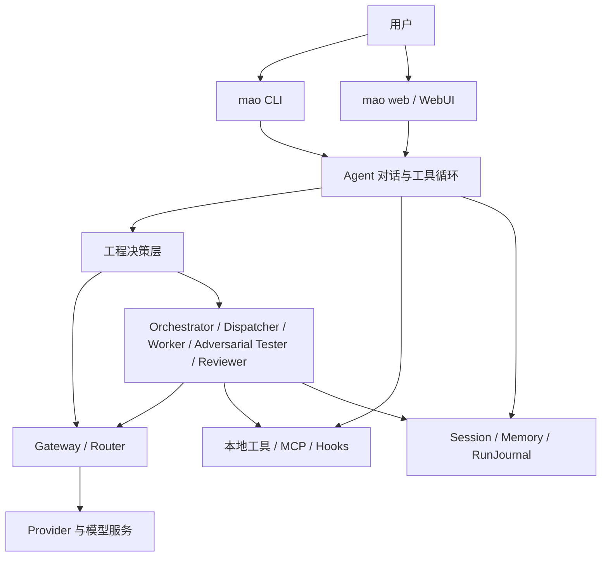

# MAO 架构概览

**适用版本**：`v0.1.0-beta.7` 及后续 Beta

**更新日期**：2026-07-21

本文描述当前代码中实际存在的架构和边界。历史阶段设计已移入 `docs/archive/`，不再作为实现真值。

## 1. 产品边界

MAO 是本地运行、可自托管的多模型工程 Agent。它负责连接多个模型服务、执行受约束的工程工具、拆分复杂任务、保存证据并在完成前执行确定性审计。

MAO 不是模型本身，也不试图突破上游模型的上下文限制。它不以“调用更多模型”为目标，而以以下结果为目标：

- 根据任务、能力、成本和可用性选择合适模型。
- 控制 token、上下文和失败重试带来的成本。
- 让用户看到计划、工具、证据、验证和剩余风险。
- 没有直接证据时不把任务标记为完成。

## 2. 总体结构

## 3. 入口与工作区

- `mao`：默认进入终端对话；首次运行时启动 Provider 配置向导。
- `mao web`：启动本地 WebUI；无 Provider 配置时仍可打开配置页。
- `mao run`：执行一次性编排任务。
- `mao-ui`：保留的兼容入口。

命令以当前目录作为项目工作区。`config/`、`sessions/`、`memory/` 和输出文件均写入当前项目，不写入 Python 安装目录。

主要入口：

- `run.py`
- `src/cli/chat_command.py`
- `src/ui/cli.py`
- `src/ui/app.py`

## 4. 模型网关

`GatewayClient` 是模型调用统一入口，负责：

- 加载 Provider 和模型映射。
- 选择主模型或指定 Worker 模型。
- 记录输入、输出 token 和估算成本。
- 在配置允许时执行模型故障切换。
- 统一流式与非流式返回格式。

Provider 层当前覆盖 Anthropic 协议、OpenAI 兼容协议、Ollama 和 llama.cpp。本地逻辑模型名与上游真实模型 ID 分离，避免把协议名误认为实际模型名。

Anthropic 工具回合同时维护三层内容：面向 UI 和旧 Provider 的字符串正文、可持久化的 `text`/`tool_use`/`tool_result` 安全块，以及仅在当前进程内回传的 Provider 私有块。私有块用于保存 thinking/signature 等协议状态，Pydantic 序列化时强制排除；工具结果必须携带原始 `tool_use_id` 并排在同一用户消息的后续文本之前。不支持结构化工具的模型继续使用 Markdown 工具块兜底。

上下文压缩不会把原生 `tool_use` 与紧随其后的 `tool_result` 分开；上下文预算按真正发送的原生载荷估算，而不是只统计展示文本。

Provider 异常由 `src/gateway/errors.py` 统一分类为可安全展示的 `ProviderError`。错误契约同时决定错误码、操作建议、是否重试、是否允许故障切换和 HTTP/SSE 表示；Gateway 不再把 SDK 原始异常直接拼接给用户。每次请求的脱敏尝试轨迹由 Agent 转为 RunJournal Evidence，记录尝试次数、错误码、尝试模型和最终模型。

关键模块：

- `src/gateway/client.py`
- `src/gateway/errors.py`
- `src/gateway/provider.py`
- `src/gateway/local_provider.py`
- `src/gateway/router.py`
- `src/models/catalog.py`
- `src/models/schemas.py`

## 5. Agent 与工程决策层

`Agent` 负责多轮对话、流式输出、工具循环、权限请求和协作触发。工程决策层在模型输出之外维护确定性状态：

- `TaskIntent`：保存请求进入系统时的任务类型、风险、写入授权和验证深度。
- `ExecutionDepthDecision`：保存 `fast/standard/deep` 的请求值、建议值、实际值、选择原因和执行预算。
- `ModelRoutingDecision`：保存用户主模型、实际模型、路由来源、能力/上下文/健康/价格判断及完整候选审计。
- `ObservedMutation / effective_intent`：根据真实写入动态收紧风险和完成审计；与初始权限意图分离，不能扩大本轮工具权限。
- `WorkPlan`：带状态约束的计划步骤。
- `Evidence`：来自真实工具、文件、测试或运行状态的证据。
- `Hypothesis`：必须绑定证据才能标记为支持或反证。
- `VerificationGate`：针对性、相邻、集成、全量和 smoke 验证。
- `RequirementCheck`：用户要求、实现证据和验证证据的映射。
- `CompletionAudit`：决定任务是否真的可以结束。
- `RunJournal`：单轮运行的持久记录。

模型生成的“已完成”不能覆盖确定性审计失败。

交付总结不再依赖压缩后的对话消息。`DeliveryReportBuilder` 从本会话或今日全部 RunJournal 聚合带 provenance 的创建、修改、验证、待办、用户步骤和风险，并统计职责模型 token/成本、成功率、首轮可运行率、返工、误诊和 token/有效交付。CLI `/report`、Web 工程汇总和明确自然语言报告请求使用同一条零 Provider 路径。

关键模块：

- `src/core/agent.py`
- `src/core/native_content.py`
- `src/core/engineering/classifier.py`
- `src/core/engineering/execution_depth.py`
- `src/core/engineering/evidence.py`
- `src/core/engineering/verifier.py`
- `src/core/engineering/audit.py`
- `src/core/engineering/journal.py`
- `src/core/engineering/benchmark.py`
- `src/core/engineering/benchmark_agent.py`
- `src/integrations/harbor_agent.py`
- `src/gateway/router.py`

`ExecutionDepthResolver` 根据任务类型、风险和验证深度自动建议执行档位，也接受会话级显式选择。显式选择不能低于安全下限；真实写入后的有效意图会重新收紧执行深度。三个档位确定性约束主 Agent/Worker 工具轮次、上下文比例、Worker 并发、协作 Reviewer 和变更验证下限，但不参与授权判断，也不能扩大工具权限。

`ModelRouter` 在调用前完成一次有界选择：任务类型和执行深度决定所需能力，只有显式 `supported` 能力可以支持自动升级；价格、上下文和健康状态必须来自本地配置真值。未知价格不能形成节省结论，自动升级最多一次，`fixed` 模式始终使用用户主模型。路由失败先回退用户主模型，之后才进入 Gateway 原有的运行时 retry/failover；两层原因分别记录。

`EngineeringBenchmarkHarness` 将版本化任务合同复制到逐策略、逐轮次隔离工作区，所有策略共用响应、文件、验证命令和越界修改验收。报告独立保存模型集合、路由、执行深度和协作 profile。`FixtureBenchmarkStrategy` 只验证 harness 合同并把数据标记为 `synthetic_contract`；它不读取 Provider 配置，也不能作为真实模型优劣证据。

`benchmark_agent.py` 从新 Session 进入生产流式 Agent 链，不使用旧 `mao run` 代替。`MaoLiveBenchmarkStrategy` 通过同一 harness 运行真实策略，但构造前必须有所有者确认的 `LiveBenchmarkAuthorization`，三种策略共用 `LiveBenchmarkSpendGuard`。`allowed_models` 在调用前限制 Router 候选、Worker 回退和 failover。`harbor_agent.py` 是可选的 Harbor `BaseInstalledAgent` 边界，不进入默认运行依赖。

`AdversarialTester` 是默认关闭的实验性只读角色。它只在显式启用的 `deep change/build` 协作、全部 Worker 成功且确定性完成审计已通过后运行，只接收原始需求和直接工程证据，不接收 Worker 回复正文，也不持有工具。其结构化结论只能维持或降低完成可信度：`refuted` 将结果降为 blocked，`inconclusive` 记录剩余风险，任何结论都不能把失败或未验证结果升级为完成。

## 6. 多模型协作

复杂任务可以进入协作路径：

1. `Orchestrator` 生成有依赖的子任务。
2. `Dispatcher` 校验依赖和路径所有权，并按安全条件调度。
3. `Worker` 在明确工具、模型、执行模式和验收标准下工作。
4. 显式实验档满足条件时，`AdversarialTester` 只读尝试推翻已通过的实现结论。
5. `Reviewer` 汇总结果，但不能绕过工程审计或对抗反例。

Reviewer 默认使用 `restricted` 输入模式：只读取原始需求、计划合同、职责状态、文件清单和直接 Evidence/Verification/Requirement/Audit，不读取 Worker 输出正文；`workers.yaml` 可显式切换 `full`。实际模式写入 RunJournal collaboration metrics，任何模式都不能覆盖失败 Worker 或确定性审计。

项目级高风险前端构建使用额外的结构化合同：Orchestrator 固定拆分架构/脚手架、页面、数据/API 和集成四个 Worker 阶段，Reviewer 作为第五职责。合同声明项目根、入口、路由目标、npm 依赖、逐任务所有权、验证命令和 smoke 路径。集成 Worker 仅在全部实现依赖成功后运行，并在返回成功前确定性检查文件、依赖和相对 import 闭包；每条验证命令必须来自真实成功的工具轨迹，Worker 正文不能作为验证证据。各职责和实际模型写入 RunJournal `metrics.collaboration`。

协作边界包括：

- 子任务依赖和循环检测。
- `owned_paths` 共享绝对路径所有权。
- 相对写入隔离目录。
- `parallel_safe` 并行安全声明。
- 仅对瞬时失败执行目标任务重试。
- Worker 工具轨迹回收到主 RunJournal。

关键模块：

- `src/core/orchestrator.py`
- `src/core/dispatcher.py`
- `src/core/worker.py`
- `src/core/adversarial_tester.py`
- `src/core/reviewer.py`
- `src/core/collaboration.py`
- `src/core/frontend_contract.py`

## 7. 工具与权限

工具由 `ToolRegistry` 统一注册，支持 Markdown 工具块和部分模型的原生 tool use。工具来源包括内置工具、贡献模块和 MCP。

项目命令先由只读 `discover_project_commands` 从实际配置发现。`run_command` 使用独立、规范化的 cwd 和参数数组，固定 `shell=False`；拒绝内联 cd、管道和重定向。每次执行记录 argv、cwd、退出码、耗时、输出截断和权限决策。Vite 构建可使用自动清理的临时输出，预检失败最多允许一次纠错且不计为测试验证门。

高风险前端集成额外使用 `frontend_smoke`。它按结构化合同启动 loopback dev/preview server，自动选择动态端口并管理进程树，再以 Playwright 在桌面/移动视口检查登录、路由、数据/画布、console/page error、横向溢出和声明式遮挡。浏览器结果直接生成 smoke Evidence 与 VerificationGate；浏览器缺失、server 超时或任一断言失败都不能被模型正文覆盖。

稳定性发布门由 `StabilityReplayRunner` 使用公开脱敏智慧矿区夹具离线重放。它把分类、四职责前端合同、闭包、真实命令、浏览器 smoke、完成审计和交付报告串为同一确定性链；正常样例必须完成，错误 Mock 和缺失路由样例必须 blocked，Provider 调用固定为 0。CI 运行同一脚本，避免只测单模块而漏掉跨层合同。

可选 Hook/MCP 扩展使用进程内幂等加载器。配置缺失时静默跳过；单个坏条目不会阻止合法条目或核心启动。加载结果最多保留 10 条脱敏诊断，只包含稳定错误码、固定说明、操作建议、配置文件名、条目索引和异常类型，不保留异常文本、完整路径、命令参数或环境变量。CLI 启动时显示简短摘要，Web 通过 `/api/diagnostics/extensions` 提供独立状态；可选扩展失败不会让 `/health` 变为不健康。

Plugin API v0（`src/plugins/`）把工具、ToolSource、Hooks、Provider 预设与模型能力数据统一为可诊断、可版本约束、必须显式启用的扩展接口。插件经标准 Python entry point 组 `mao.plugins` 发现（不扫描工作区），由 `PluginManifest` 声明 id/版本/`mao_api_version`/能力/权限；默认关闭，用户在 `config/plugins.yaml` 显式启用后由 `PluginManager` 在启动时隔离加载。`PluginContext` 记录每个插件的全部贡献，加载失败或禁用时 `rollback` 撤销，不影响其他插件或无插件启动；`shutdown` 注销贡献并关闭资源。`MAO_PLUGIN_API_VERSION="0.1"`，不兼容版本被拒绝。Python 插件为可信本机代码，与 MAO 进程同权限，权限仅作同意展示、不构成沙箱；外部工具仍优先 MCP 进程边界。CLI `mao plugin list/doctor/enable/disable` 与 Web `GET /api/plugins` + chat「插件」只读标签暴露插件清单与权限。

权限有两层：

- 会话模式：`auto`、`approve`、`readonly`。
- 任务策略：问答、解释、诊断、审查和方案保持只读；修改和构建按会话模式执行；无法稳定分类的请求把工具权限交给会话模式，但不因此伪装成需要工程验证的修改任务。

当前已经扩展为四层判定：明确任务/Plan 硬边界 → 用户与项目权限规则 → 会话模式默认 → 工具执行。权限规则由 `src/core/permission_rules.py` 统一实现，优先级为 `deny > ask > allow`；路径规范化和复合命令分段发生在执行前。主 Agent 与 Worker 共享同一实例，Orchestrator 无法通过拆任务扩大权限。

`auto` 对允许写入或未明确分类的请求直接执行工具；`approve` 自动执行读取，对写入、命令和其他非只读工具逐次发出权限请求；`readonly` 自动执行读取并拒绝所有非只读工具。明确的“不修改、只读、只做方案”任务边界优先于会话模式。`permission_follows_session` 只负责工具可用性，`allow_project_writes` 继续负责工程变更审计，两者不得重新混为一个开关。

关键模块：

- `src/tools/registry.py`
- `src/tools/worker_tools.py`
- `src/tools/search_tools.py`
- `src/tools/web_tools.py`
- `src/tools/mcp_adapter.py`
- `src/tools/extensions.py`
- `src/tools/extension_diagnostics.py`
- `src/core/hooks.py`
- `src/core/permission_rules.py`
- `src/core/project_rules.py`
- `src/plugins/api.py`
- `src/plugins/manager.py`
- `src/plugins/runtime.py`

## 8. 会话、上下文与记忆

- `SessionStore` 保存多轮消息和会话设置。
- `Session` 持久化 Plan 状态与 artifact；未批准时整个调用链为只读。
- `SessionRecoveryManager` 从最新 RunJournal 检测 running/blocked/未完成计划；CLI/Web 在显式继续或放弃前阻断新消息。继续仅把未完成步骤检查点交给一个新 run，旧 run、完成步骤和既有文件不自动重放。
- `RunJournal` v5 保存每轮初始/有效意图、执行深度、完整模型路由决策、真实写入观察、计划、证据、验证和审计；v3/v4 记录保持向后兼容。
- `MemoryStore` 保存稳定项目事实，与任务检查点分离。
- `ProjectIndexer` v2 按项目根持久化目录树、文件摘要与 SHA-256；mtime/size 未变时零内容读取，变化文件用 hash 决定是否重建摘要。`project_tree` 和 `search_project_files` 优先增量刷新，损坏或跨根索引自动重建。
- `ContextBudgetManager` 根据模型窗口、输出预留和安全比例计算预算。
- `ContextCompactor` 在达到阈值时形成 L0 旧摘要 artifact 引用、L1 结构化摘要和 L2 近期全文；纯文本去重不触碰原生工具块，Schema/实体质量和相关 token 指标进入压缩事件。当前 RunJournal 固定 checkpoint 独立于摘要保存。
- `DeliveryReportBuilder` 从全部本地 RunJournal 聚合会话/今日交付事实和 token 效率，不依赖已压缩消息，也不调用 Provider。

未知模型继续使用保守预算，并标记来源未验证；MAO 不猜测 Coding Plan 套餐背后的真实上下文窗口。

## 9. WebUI

WebUI 使用 FastAPI、Jinja2 和原生 JavaScript/CSS，不需要前端构建链。当前包含：

- Provider 配置、预设和连接测试。
- 会话管理、流式对话和权限确认。
- 项目文件树和受限文本预览。
- 协作任务状态和工程运行摘要。
- 上下文预算与记忆侧栏。
- 持久化 Plan 状态带、修订、批准实施和取消控制。
- 默认关闭的会话级对抗测试开关，以及结构化完成状态提示。

Plan 草案由主 Agent 先进行真实只读侦察，再交给 `PlanningCouncil` 的 evidence/architect/critic/synthesizer 四个无工具角色。所有角色获得同一项目规则、权限摘要和证据边界；失败角色只能留下诊断，不能伪造证据或覆盖稳定草案。

## 10. 必须保持的架构约束

后续开发不得破坏以下约束：

1. 用户未授权时不扩大写入范围。
2. 用户已有 Git 改动不能被自动回滚。
3. 模型正文不能伪造工具证据或测试结果。
4. 缺少必需验证时任务保持 `blocked`。
5. 未确认的模型窗口不能展示为官方真值。
6. 密钥、Session 和私有 Provider 配置不得进入 Git。
7. 多模型并行必须有依赖和路径所有权边界。
8. Plan 模式必须在执行边界约束主 Agent、MCP、shell 和所有 Worker，不能只靠隐藏工具。

## 11. 当前主要缺口

- 自动路由已有离线合同和 mock 执行证据，但尚无经授权的真实模型效果数据；不能据此宣传成本或完成率优势。
- B5.1 只有程序化离线 benchmark 合同，尚无经授权的真实 Provider 对比数据。
- Provider 能力和模型特例尚未形成可验证的兼容性矩阵。
- 工具执行没有容器级沙箱。
- 真实任务的 token 节省、完成率和误修改率尚缺公开基准。

这些缺口由 [`MAO-产品方向与Beta路线图.md`](MAO-产品方向与Beta路线图.md) 统一排序。
